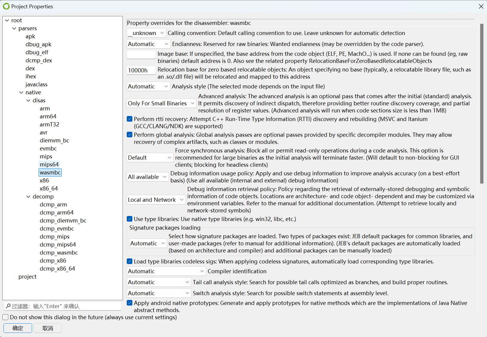
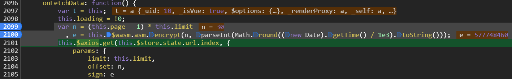
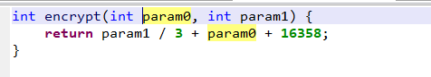
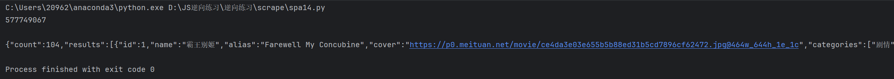

# Wasm**流程**

* 打开F12抓包工具，分析请求网址的加密参数，找到wasm文件和加密函数在js中的位置

* 下载wasm文件，将wasm文件放入jeb反汇编调试工具中，选择wasmbc。

  

* 对网页和调试工具中的代码进行动静态结合调试

  

  这里是sign的加密位置，this.$wasm.asm.encrypt（）为加密函数，这个加密函数在wasm文件中执行。

  让我们看看wasm中这个函数长什么样子。

  进入打开wasm文件后的jeb工具界面。

  

  

  在左边有五个函数，这里加密函数的特征已经很明显了。

  双击encrypt

  

  然后按下tab键，一键反编译。

  得到如下的c代码函数，根据得到的c代码转写成其他语言的代码就方便多了（而不是根据汇编代码进行转写）。

  

  

* 现在我们来编写加密函数

  这里将**this.$wasm.asm.encrypt（）换成了我们自己编写的encrypt函数**，因为这个函数是存在wasm代码中的。

  ```
   function encrypt(a,b){
  	 return Math.floor(b/3 + a + 16358)
   }
   function getSign(num){
  var n = (num - 1) * 10
   , e = encrypt(n, parseInt(Math.round((new Date).getTime() / 1e3).toString()));
   console.log(e)
   }
   getSign(1)
  
  ```

  

  

* 最终我们运行代码

  

正常得到接口的返回值，至此一个简单的wasm已经破解完成。


var result = Module.ccall(ident, returnType, argTypes, args);